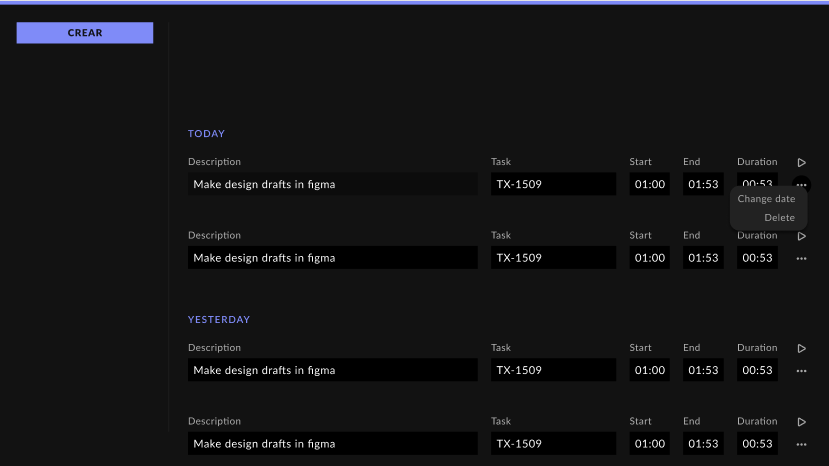
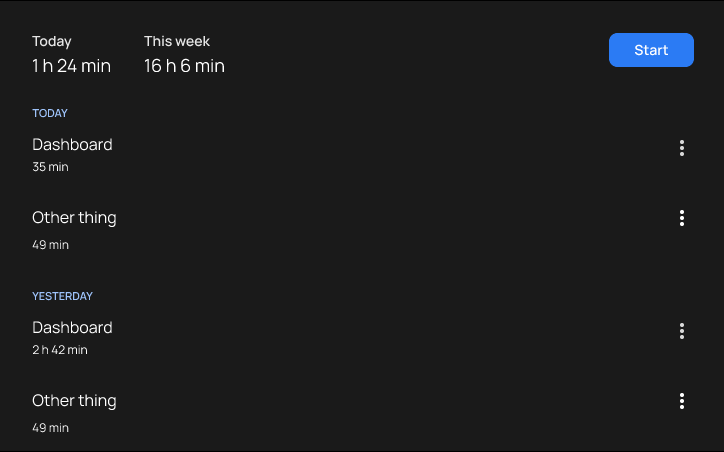

# Elm Time Tracker

[Visit the application][elm-time-tracker]

I began working on software engeneering during the coronavirus pandemic. I started at a small company—we were 3 developers at the time—where we were paid hourly. To keep track of our working hours, we used a very complete and professional time tracking application.

We tracked our time with associated Jira ticket names in a UI that resembled a spreadsheet. I didn't like it at all.

I did understood its usefulness though. Keeping track of the time spent on each task helped me humble my expectations about the time it took to finish anything. I just didn't like the bureaucratic aspect of it. It took me time and effort to decide how to name each entry. It felt ironic to *waste time* using a time tracking app.

Eventually, I wanted to learn [React hooks][react-hooks]—the shiny new thing at the moment—by making a small personal project. Arguably time tracking (or anything involving timers) is one of the worsts ways to learn React hooks (I'm looking at you, dependency array), but I managed to [make it work][react-time-tracker].

It felt right at the time, but I was inspired by the same user interface I was using at work, so I inherited some of its problems. For instance, I had the ability to create different *projects* (with associated colors) to differentiate entries. This was not necessary for my personal use, and it created friction before starting a task.

Fast forward a couple of years, I wanted to learn the [elm programming language][elm-language]—a delightful language for reliable web applications—by making a small personal project. Redoing the time tracker was an opportunity to learn from my past mistakes.

This time I started with a design process using Figma. It took me some time to figure out what I wanted. First I tried a dark-themed spreadsheet.

I steered away from the spreadsheet layout in a second iteration.

It felt like the dark-theme resembled the UI of a game or a coding environment. Since time tracking is the first thing you do when you start to work in something, I wanted something bright and uplifting. I found inspiration in the iPhone's [Voice Memos app][voice-memos-ios].

I came out with a new design with very clearly differentiated paused and playing states:

| Paused                 | Playing                |
| ---------------------- | ---------------------- |
|  |  |

Entries didn't belong to a *project* anymore, and giving them a description was optional. I also added some settings:

This design was fine but I knew it could be improved.

I don't really need to provide a description to each task, as most of the times it's easy to infer it from the date and time. I don't need the search bar either.

The **today's total** is very important if you work hourly because you can use it to calculate how much time you need to work to finish the daily hours.

So I made some temporal fixes, but it was not enough.

Simultaneously, I began working on a complete, final redesign. The final design is the one you can test now visiting the [deployed site][elm-time-tracker].

As the previous time, I started with a Figma file.

I placed **today's total** below the **Start** and **Stop** buttons. I got rid of **this week's** total.

The previous entries are hidden in the **History** page, as most of the time you don't need to consult them.

I hid parts of the UI when they're not relevant. For example, the **today's total** is hidden if it equals 0 seconds and the **History** button is hidden when there are no entries.

It was 5 years ago when I began the [first iteration of this project][react-time-tracker]. I didn't imagine it would take half a decade to reach closure with this project. It's certainly not perfect, but it is what I wanted. I'll move on to something else.

[elm-time-tracker]: https://mauroc8.github.io/elm-time-tracker/
[react-hooks]: https://react.dev/reference/react/hooks
[react-time-tracker]: https://mauroc8.github.io/react-time-tracker/
[elm-language]: https://elm-lang.org/
[voice-memos-ios]: https://apps.apple.com/us/app/voice-memos/id1069512134
